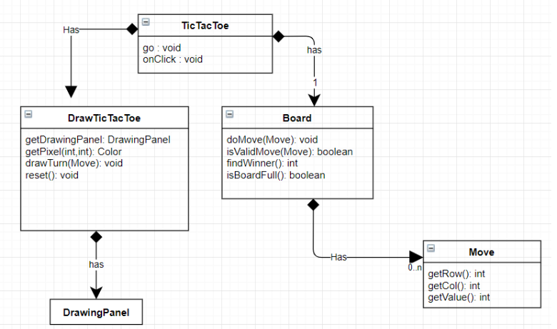

# Product Title Goes Here
*Simulating the phases of SDLC*

> Summary: See the document `project_summary.md` for an overview of the project. This document will be fore **part 2** which focuses on:
> * Architecture Diagrams  
> * Design(s) for a low-level module  
> * Threat Analysis  
> * Release Strategy  
> 
> While there are many nice tools that you can use to draw diagrams, you may choose to draw your diagrams by hand–just take a picture of them and include the pictures in your submission.
>
> While the template document uses images from the internet, you must **create your diagrams from scratch**. You may not use an image found on the internet.

## Architecture
> Your team will create a minimum of four (4) diagrams to represent your product’s architecture. (Consult Sommerville chapters 5-7.) The diagrams should be clear and easy to interpret. Each diagram should include explanatory text adding context and details that may not be present or obvious in the diagram. If there are multiple types of lines or shapes, provide a legend to clarify what they mean(e.g. solid/dashed lines, circles vs squares). Each diagram should be consistent within itself.  
>
> For each diagram you’ll provide a paragraph of explanatory text to tell the “story” of the diagram. This is an “elevator pitch” of what you’d say to an audience if you were to do a presentation. This paragraph might take the place of a legend, or at least reduce what is found in the legend, particularly for a diagram where industry standards are followed without variation. For example, if you draw a process diagram, you don’t need to have a legend explaining what the arrows mean. 
>
> The team should have one of each of the following diagrams: 
> 1. Use Case Diagram  
> 2. Data Flow Diagram  
> 3. Layered Architecture as a Block Diagram  
> 4. One of the following:  
>       * Sequence Diagram  
>       * Activity Diagram  
>       * State Diagram  
>       * Or, other diagram not listed  

### Use Case Diagram
> Insert a Use Case Diagram here.  Replace the example Use Case Diagram shown here. The diagram is from [UML Use Case Diagram Tutorial | Lucidchart](https://www.lucidchart.com/pages/uml-use-case-diagram)  which has a tutorial on the basics of the diagram.
  
> While the Use Case Diagram can be very simple, you should provide a paragraph explaining “the obvious.” Explain what your boundaries (boxes) are, if you have them. Explain the types of lines/arrows and any `<<include>>` annotations between the processes (circles).

### Data Flow Diagram
> Insert a Data Flow Diagram here.  Replace the example Diagram shown here. The diagram is from [Data Flow Diagram Examples Symbols, Types, and Tips | Lucidchart](https://www.lucidchart.com/blog/data-flow-diagram-tutorial) which has a tutorial on the basics of the diagram.  
  
> You may have a “double circle” to represent large & complex processes, or perhaps you use colors to differentiate. You may use different shapes than what you see above to identify users and repositories. Provide a legend. Be sure that you have directional arrows (arrows with “heads”). 
>
> Add dashed lines to represent boundaries, both physical and important logical boundaries. For example, data centers and the user’s desktop pass through the internet. I’ve added these to the example above so they may not actually make perfect sense. Don’t add them if you don’t have them. 
> 
> Once again, provide a paragraph of explanatory text to tell the “story” of the diagram. This is an “elevator pitch” of what you’d say to an audience if you were to do a presentation.

### Layered Architecture as a Block Diagram
> Replace the sample diagram below with one that represents the layers and containment of modules in your product. There are many diagrams that include blocks. If you search the internet, you'll find many different diagrams with arrows that indicate state, process flow, and more. In this diagram you are to have ZERO arrows. The position of the blocks is supposed to tell the story.  

  

> Once again, provide a paragraph of explanatory text to tell the “story” of the diagram. This is an “elevator pitch” of what you’d say to an audience if you were to do a presentation. 

### {Choice Diagram}
> Pick a diagram that is of a type that is not one of the above. Your specific type will depend on what your product does and the information you want to convey. You may drill down on a single important user experience and provide an [Activity Diagram](https://www.geeksforgeeks.org/unified-modeling-language-uml-activity-diagrams/) like what I’ve done here.  
  
> Once again, provide a paragraph of explanatory text to tell the “story” of the diagram. This is an “elevator pitch” of what you’d say to an audience if you were to do a presentation. 

## Module Design
> Your team will pick a specific module (sub-system, component, process) of your product to detail. You will diagram one module with 1-2 diagrams. See Topics 8, 9 & 11 for reference.
> 
> You can choose any diagram type. In addition to the above diagrams, consider: 
> * Class Structured Analysis (Entity-Relationship Diagram)
> * Object-Oriented Diagrams (Class Hierarchy Diagram)
> * State Diagram

### Purpose
> Explain the purpose of this module. Provide its roles and responsibilities. In this example we are detailing a JukeBox module’s interfaces.  

### Required Interfaces
> Required interfaces are the dependencies of this module. Required interfaces are the inputs into this module. You can provide a list of interface names.
> 
> Example: The JukeBox module requires the interface, AudioInputStream, to gain access to the hardware to actually play the sound. It requires the interface, UserPlayList, to gain access to the set of music that the user has. And, the JukeBox requires the FileSystem interface to access the storage of files.

### Provided Interfaces
> `Provided interfaces` are the results/product/output of this module. Give a name for your interface and a list of behaviors it provides.  
 
> 
> Be as detailed as you can. For instance, attempt to provide API method names and argument types for the interfaces. Consider adding a description of a Design Pattern used in its implementation.
>
> In this interface diagram, you’ll see the module/component B provides one interface and requires one interface. It is not required to provide an image like this one, but it can be good, especially if a module has many clients of its provided interfaces, or if it has many required interfaces.  
  

### Class Diagram
> You may choose any type of diagram for your module. To save time, Mr. Stride has provided a sample Class Diagram for a TicTacToe game. Your diagram should be of the SAME module as the one for which you provided interface information above.  

## Threat Analysis
Your team will conduct a threat analysis of your product by identifying critical assets and examining your product’s data flow diagram. Using STRIDE, your team will document a list of 10-20 threats (potential attacks). For each threat, you will do a DREAD analysis to estimate its total score. For the top 3 threats, document mitigation steps.

Create one Threat Tree.  See the Template Document for more information.

Use the Threat Analysis Template spreadsheet to do your work. In this sheet there are two sheets. The first is where you’d list out your threats and categorize them.  
  

## Release Strategy
> Your team will describe how your product will be released. Describe your git branch strategy and release schedule with dates. Describe whether you make use of continuous integration, flighting, prototypes, beta, or experimentation. Describe how long you expect the product to be in maintenance mode before officially starting the next version. Provide diagrams where appropriate along with descriptive text.

  
> Describe:  
> * how often you will release your product. If you plan to flight your product, or do a Beta, be sure to explain that.  
> * what maintenance/development will happen after your release.  
> * specific timelines using actual dates.  
> * the drawing of your Git Branching strategy. Label the branches.  
> * Tags: explain when the product may be tagged.  
> * If you do Beta and/or Flighting, label where those might occur.  

> These terms should appear in a lecture and/or article. But here are some definitions:
> * **Continuous Integration**: Small code changes are pushed into the main repository frequently. Quality is maintained by having automated tests triggered before integration is allowed. This is often called “Gated Check-in.” 
> * **Flighting**:  Releasing a product/feature to a small group of users to gather performance metrics and/or user feedback before releasing to the world.
> * **Git Branch Strategy**: A strategy for how and when branches are created and merged in order to achieve development velocity, independence, quality, and code history for each release.

