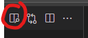
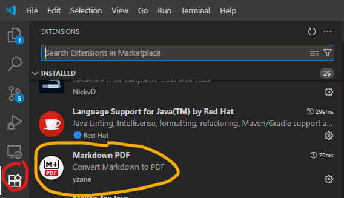
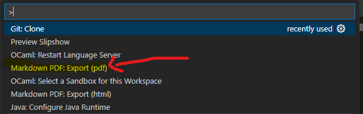

# Team Report

You need to write your report in markdown. 

If you write it in VS Code, you can see what your report will look like in the split window.  



Put images into the `images` directory.  

You can create a PDF of your report by installing the Markdown Package.  
  

Then use the Pallet to create a PDF. 

On Windows, Type:  
```
Ctrl+Shift+P
--or--
F1
```


## Markdown Help
Markdown is a lightweight markup language that allows you to format text using plain text syntax. It is widely used for creating formatted documents, especially in the context of web development and documentation.

Basic Syntax

Headings

To create headings, use the # symbol followed by a space and the heading text. The number of # symbols indicates the heading level:

# Heading level 1
## Heading level 2
### Heading level 3
**Paragraphs**  

To create paragraphs, simply write your text separated by blank lines:

This is the first paragraph

This is the second paragraph

To create a newline, end your line with at least two spaces  
**Emphasis**

You can add emphasis to text by making it **bold** or *italic*:

Bold: Use double asterisks \*\* or double underscores \_\_:   
**bold text** and __bold text__

Italic: Use single asterisks \* or single underscores \_: *italic text* and _italic text_

Bold and Italic: Use triple asterisks *** or triple underscores ___: ***bold and italic text*** ___bold and italic text___

### Blockquotes

To create blockquotes, use the `>` symbol before the text:

> This is a blockquote
Blockquotes can contain multiple paragraphs and other elements like headings and lists.

### Lists 

You can create ordered and unordered lists:

**Ordered Lists**: Use numbers followed by periods: 1. First item 2. Second item 3. Third item

**Unordered Lists**: Use dashes -, asterisks \*, or plus signs +: 
- First item
- Second item  
- Third item  

### Code

To denote code, enclose it in single backticks \`: \`code\` will present as `code`.   

For code blocks, use triple backticks: \`\`\`. You can also add a programming language after it such as `java` or `python`.

```java
public static void main(String[] args) {
    // My main entry point
    System.out.println("Hello, World!");
}
```

### Links
To create links, enclose the link text in brackets `[]` and the URL in parentheses `()`:
```markdown
Links like like this:  
[Duck Duck Go](https://duckduckgo.com)

To add images, use an exclamation mark ! followed by alt text in brackets [] and the image URL in parentheses ():

Images look like this:


```

To create horizontal rules, use three or more asterisks `***`, dashes `---`, or underscores `___` on a line by themselves:

---

### Escaping Characters

To display a literal character that would otherwise be used to format text, add a backslash \ before the character:

\*This text is not italicized\*


